# Guia extensa de las interpretaciones de la mecanica cuantica

## Como usar esta guia

Esta guia esta pensada como un tutorial largo y autocontenido. Si vienes por primera vez al tema, puedes leer las secciones 1 a 4 y despues saltar a las interpretaciones que mas te interesen. Si ya conoces el formalismo cuantico, puedes ir directamente a las comparativas y a la bibliografia comentada del final.

## Ruta editorial del repositorio

Esta guia ya no trabaja sola. Ahora funciona como documento maestro y puerta de entrada a una serie de articulos monograficos mas extensos.

### Indice de articulos largos

- [Que significa una interpretacion cuantica](articulos/00-que-significa-una-interpretacion-cuantica.md)
- [Fundamentos, medicion y estructura del problema](articulos/01-fundamentos-medicion-y-estructura-del-problema.md)
- [Copenhague, instrumentalismo y lecturas de conjunto](articulos/02-copenhague-instrumentalismo-y-conjunto.md)
- [Mecanica bohmiana y variables ocultas](articulos/03-mecanica-bohmiana-y-variables-ocultas.md)
- [Everett, ramificacion y muchos mundos](articulos/04-everett-ramificacion-y-muchos-mundos.md)
- [Colapso objetivo: GRW, CSL y propuestas afines](articulos/05-colapso-objetivo-grw-csl-y-afines.md)
- [Relacional, QBism y enfoques informacionales](articulos/06-relacional-qbism-e-informacionales.md)
- [Bell, contextualidad y teoremas de no-go](articulos/07-bell-contextualidad-y-teoremas-de-no-go.md)
- [Historias, modales, retrocausales y propuestas heterodoxas](articulos/08-historias-modales-retrocausales-y-propuestas-heterodoxas.md)
- [Introduccion al multiverso, las multiples historias y la simulacion](articulos/09-multiverso-muchas-historias-y-simulacion.md)
- [Que se entiende por realidad en la fisica actual](articulos/10-que-se-entiende-por-realidad-en-la-fisica-actual.md)
- [Observador, conciencia y medicion en mecanica cuantica](articulos/11-observador-conciencia-y-medicion-en-mecanica-cuantica.md)
- [Tiempo, fase y estructura temporal en mecanica cuantica](articulos/12-tiempo-fase-y-estructura-temporal-en-mecanica-cuantica.md)
- [Desarrollos recientes en fundamentos e interpretaciones cuanticas](articulos/13-desarrollos-recientes-en-fundamentos-e-interpretaciones-cuanticas.md)
- [Ontologia y significado de la realidad en fundamentos cuanticos](articulos/14-ontologia-y-significado-de-la-realidad-en-fundamentos-cuanticos.md)
- [Dimensiones del espacio-tiempo y su relacion con las interpretaciones cuanticas](articulos/15-dimensiones-del-espacio-tiempo-y-su-relacion-con-las-interpretaciones.md)
- [Identidad de particulas, indistinguibilidad y entrelazamiento](articulos/16-identidad-de-particulas-indistinguibilidad-y-entrelazamiento.md)
- [Decoherencia, bases preferidas y mundo clasico](articulos/17-decoherencia-bases-preferidas-y-mundo-clasico.md)
- [Probabilidad, regla de Born y significado del azar cuantico](articulos/18-probabilidad-regla-de-born-y-significado-del-azar-cuantico.md)
- [La funcion de onda: estatuto ontologico, semantico y nomologico](articulos/19-la-funcion-de-onda-estatuto-ontologico-semantico-y-nomologico.md)
- [Hechos observados, amigo de Wigner y autorreferencia](articulos/20-hechos-observados-amigo-de-wigner-y-autorreferencia.md)
- [Separabilidad, composicionalidad y sistemas cuanticos compuestos](articulos/21-separabilidad-composicionalidad-y-sistemas-cuanticos-compuestos.md)
- [Interpretaciones y teoria cuantica de campos](articulos/22-interpretaciones-y-teoria-cuantica-de-campos.md)
- [Localidad, causalidad y covarianza relativista](articulos/23-localidad-causalidad-y-covarianza-relativista.md)
- [Cosmologia cuantica y universo como sistema cerrado](articulos/24-cosmologia-cuantica-y-universo-como-sistema-cerrado.md)
- [Gravedad cuantica y problema del tiempo](articulos/25-gravedad-cuantica-y-problema-del-tiempo.md)
- [Reconstrucciones informacionales y quantum from principles](articulos/26-reconstrucciones-informacionales-y-quantum-from-principles.md)
- [RQM en detalle: hechos relativos y consistencia intersubjetiva](articulos/27-rqm-en-detalle-hechos-relativos-y-consistencia-intersubjetiva.md)
- [QBism en detalle: agencia, probabilidad y realidad](articulos/28-qbism-en-detalle-agencia-probabilidad-y-realidad.md)
- [Historias consistentes y marcos decoherentes](articulos/29-historias-consistentes-y-marcos-decoherentes.md)
- [Retrocausalidad, transaccional y superdeterminismo](articulos/30-retrocausalidad-transaccional-y-superdeterminismo.md)
- [Copenhague, Bohr, Heisenberg y lecturas tardias](articulos/31-copenhague-bohr-heisenberg-y-lecturas-tardias.md)
- [Matriz comparativa avanzada](matriz-comparativa-avanzada.md)
- [Matriz comparativa avanzada v2](matriz-comparativa-avanzada-v2.md)
- [Glosario de fundamentos cuanticos](glosario-fundamentos-cuanticos.md)
- [Cronologia del debate interpretativo](cronologia-del-debate-interpretativo.md)
- [Rutas de lectura por perfiles](rutas-de-lectura-por-perfiles.md)
- [Preguntas frecuentes de fundamentos cuanticos](preguntas-frecuentes-de-fundamentos-cuanticos.md)
- [Estudios de caso experimentales e interpretacion](estudios-de-caso-experimentales-e-interpretacion.md)
- [Referencias anotadas para interpretaciones de la mecanica cuantica](referencias-anotadas.md)
- [Hoja de ruta editorial profunda](hoja-de-ruta-editorial-profunda.md)

### Como se reparten las funciones

- Esta guia ofrece el mapa general, las comparativas y el hilo pedagogico de conjunto.
- Los articulos largos desarrollan con mucha mas profundidad los argumentos, objeciones y tensiones internas de cada familia.
- La [bitacora editorial](bitacora.md) registra decisiones, prioridades y criterios de crecimiento del proyecto.
- El glosario, la cronologia, las rutas de lectura y la matriz v2 ayudan a usar el corpus sin perderse en el volumen.
- La FAQ y los estudios de caso ayudan a pasar del mapa conceptual a consultas puntuales y a cruces con resultados experimentales.

## Nota de alcance

Hablar de "todas" las interpretaciones de la mecanica cuantica es delicado, porque la literatura incluye familias enteras, variantes menores, programas mixtos y propuestas todavia marginales. Esta guia cubre:

- las familias historicas mas influyentes
- las interpretaciones que siguen vivas en el debate actual
- varias propuestas menos centrales, pero conceptualmente relevantes

No pretende que cada articulo aislado merezca una seccion propia. La meta es dar un mapa intelectual amplio y honesto.

## 1. Que es una interpretacion de la mecanica cuantica

Una interpretacion de la mecanica cuantica es una respuesta a preguntas como estas:

- que representa exactamente la funcion de onda
- que ocurre durante una medicion
- por que observamos resultados definidos si el formalismo admite superposiciones
- si el azar cuantico es fundamental o aparente
- si la teoria describe la realidad tal como es o solo nuestras expectativas sobre experimentos

La mecanica cuantica estandar funciona extraordinariamente bien como herramienta predictiva. El problema es que el exito operativo no nos dice por si solo que "imagen del mundo" debemos extraer de su matematica.

### Interpretacion no significa formulacion

Es importante no mezclar varias cosas distintas:

- una formulacion es una manera matematica de escribir la teoria, como la imagen de Schrodinger, la de Heisenberg o la integral de camino de Feynman
- una interpretacion es una lectura fisica u ontologica de esa teoria
- una modificacion dinamica cambia la teoria misma, como ocurre en algunos modelos de colapso objetivo

Por ejemplo, "muchos mundos" es una interpretacion. "GRW" ya no es solo interpretacion: introduce una dinamica distinta. "Decoherencia" no es por si sola una interpretacion completa, aunque sea una pieza crucial en varias de ellas.

### Que suele incluir una interpretacion completa

Una interpretacion filosoficamente seria suele intentar responder, al menos, cinco preguntas:

1. Que hay en el mundo segun la teoria.
2. Como evoluciona eso que hay.
3. Que significa medir.
4. Por que aparecen probabilidades.
5. Por que el mundo macroscopico parece clasico.

Dicho de otro modo, una buena interpretacion no solo traduce simbolos a palabras. Tambien explica por que esos simbolos tienen el exito empirico que tienen.

### Ontologia, epistemologia y uso practico

Conviene separar tres niveles que a menudo se mezclan en conversaciones informales:

- `ontologia`: que entidades existen realmente
- `epistemologia`: que podemos saber o justificar acerca de esas entidades
- `uso practico`: como se aplica el formalismo para calcular probabilidades

Dos interpretaciones pueden coincidir en el uso practico y discrepar radicalmente en ontologia. Eso explica por que tantos debates parecen "puramente filosoficos" sin serlo del todo: las predicciones pueden ser identicas, pero la estructura del mundo que cada enfoque propone puede ser muy distinta.

### Realismo, instrumentalismo y reconstruccion

No todas las posturas juegan al mismo juego.

- Las interpretaciones realistas quieren decir que estructura del mundo corresponde al formalismo.
- Las instrumentales sostienen que pedir mas puede ser un error metodologico.
- Las reconstrucciones informacionales intentan deducir la teoria desde principios operativos o de informacion, a veces sin comprometerse demasiado con una ontologia microscopica.

Gran parte del debate contemporaneo consiste en decidir si la mecanica cuantica necesita una ontologia fuerte o si basta con una lectura operativa refinada.

## 2. El nucleo formal minimo

Antes de comparar interpretaciones, conviene fijar el esqueleto comun.

### 2.1 Postulados operativos basicos

En su forma mas conocida, la teoria dice que:

1. El estado de un sistema se representa mediante un vector de estado o funcion de onda en un espacio de Hilbert.
2. La evolucion aislada del sistema es unitaria y viene dada por la ecuacion de Schrodinger.
3. Las magnitudes observables se representan por operadores.
4. La regla de Born conecta el formalismo con probabilidades experimentales.
5. Los sistemas compuestos se describen mediante productos tensoriales, lo que permite el entrelazamiento.

### 2.2 Donde aparece el problema

La tension clasica aparece cuando juntamos dos ideas:

- la evolucion unitaria preserva superposiciones
- una medicion parece producir un solo resultado definido

Si un sistema esta en una superposicion como:

```text
a|arriba> + b|abajo>
```

y lo acoplamos a un aparato de medida inicialmente en estado `|listo>`, la evolucion unitaria sugiere algo del tipo:

```text
a|arriba>|aparato: arriba> + b|abajo>|aparato: abajo>
```

Pero nuestra experiencia no parece ser una superposicion de punteros. Parece haber un resultado concreto. La pregunta es: que pasa exactamente ahi.

### 2.3 Estados puros, mezclas y matrices de densidad

Una parte importante de la confusion pedagogica nace de no distinguir bien entre:

- un `estado puro`, que representa una superposicion coherente
- una `mezcla estadistica`, que representa ignorancia clasica o preparaciones heterogeneas

Matematicamente, la herramienta adecuada es la matriz de densidad. Para un estado puro como

```text
|psi> = a|arriba> + b|abajo>
```

la matriz de densidad contiene terminos diagonales y tambien terminos fuera de la diagonal. Esos terminos fuera de la diagonal codifican la coherencia cuantica, es decir, la posibilidad de interferencia.

Cuando vemos una mezcla clasica, esos terminos no estan presentes. Esta diferencia es decisiva: muchas interpretaciones aceptan que, despues de interactuar con un entorno, el subsistema relevante se parece muchisimo a una mezcla clasica. Pero no todas aceptan que eso baste para decir que ya existe un solo resultado real.

### 2.4 La cadena de von Neumann

Una medicion idealizada suele describirse como una cadena:

```text
sistema -> aparato -> entorno -> observador
```

Cada eslabon puede tratarse, al menos en principio, como otro sistema cuantico. Y ahi aparece el nucleo del problema: si todo evoluciona unitariamente, la superposicion no desaparece; se propaga a lo largo de la cadena.

Esto suele llamarse `cadena de von Neumann`. La tension es clara:

- si el aparato es cuantico, tambien puede quedar en superposicion
- si el observador es cuantico, tambien puede quedar correlacionado en superposicion
- si cortamos la cadena en algun punto y declaramos "aqui ocurre el resultado", debemos explicar por que justo ahi

Las interpretaciones difieren precisamente en el modo de cerrar o reinterpretar esta cadena.

### 2.5 Decoherencia: que hace y que no hace

La decoherencia describe como un sistema que interactua con su entorno pierde coherencia observable en ciertas bases estables, llamadas a veces `bases puntero`. A efectos practicos, el entorno "dispersa" la informacion de fase y hace que las interferencias entre alternativas macroscopicas sean extraordinariamente pequenas.

Eso tiene consecuencias enormes:

- explica por que las superposiciones macroscopicas son tan dificiles de observar
- selecciona bases aproximadamente estables para descripciones clasicas efectivas
- justifica por que ciertos observables del aparato parecen tener valores robustos

Pero la decoherencia, por si sola, no responde automaticamente a todas las preguntas:

- no demuestra sin mas que exista un unico resultado real
- no convierte una superposicion global en una mezcla clasica fundamental
- no decide por si sola entre Everett, Bohm, GRW, RQM o QBism

En otras palabras, la decoherencia es una pieza fisica crucial, pero no una interpretacion completa.

## 3. Los problemas conceptuales que toda interpretacion debe enfrentar

### 3.1 El problema de la medicion

La version corta es esta: como se pasa de una superposicion a un resultado unico. Las interpretaciones difieren precisamente en la respuesta:

- algunas dicen que hay colapso real
- otras dicen que no hay colapso y que todos los resultados ocurren de algun modo
- otras sostienen que el estado cuantico no describe directamente la realidad fisica individual

Una forma celebre de presentar el problema, asociada a discusiones de Maudlin y otros, es notar que las tres afirmaciones siguientes no pueden mantenerse a la vez sin tension:

1. La funcion de onda da una descripcion completa del sistema.
2. La funcion de onda siempre evoluciona linealmente segun Schrodinger.
3. Las mediciones tienen resultados unicos y definidos.

Las grandes familias interpretativas renuncian o reinterpretan una de estas tres piezas:

- Bohm niega que la funcion de onda sea toda la historia, porque anade variables adicionales.
- Everett mantiene 1 y 2, pero relee 3 en terminos de ramificacion.
- GRW mantiene 1 y 3, pero modifica 2.
- Copenhague o QBism suelen reinterpretar el sentido mismo de 1 o de 3.

Esta manera de plantearlo ayuda mucho: deja claro que el problema de la medicion no es una vaguedad psicologica, sino una tension formal concreta.

### 3.2 El problema de la base preferida

Si el estado global puede descomponerse en muchas bases, por que ciertos resultados macroscopicos parecen privilegiados. La decoherencia ayuda a explicar por que ciertas bases son estables frente al entorno, pero no siempre resuelve por si sola el problema completo.

Por ejemplo, un aparato de medida real no registra "cualquier" descomposicion matematica del estado. Registra cosas robustas como:

- una aguja apuntando a la izquierda o a la derecha
- una burbuja en una camara
- un pixel iluminado o apagado

El problema es explicar por que esos grados de libertad se comportan como portadores casi clasicos de informacion. La decoherencia ayuda mucho al mostrar que ciertas variables se acoplan al entorno de forma especialmente estable, pero la interpretacion todavia debe decir que estatuto ontologico concedemos a esa estabilidad.

### 3.3 El problema de los resultados definidos

Aunque la decoherencia suprima interferencias practicas entre ramas, aun queda la pregunta: por que observo este resultado y no una mezcla vaga o una coexistencia ambigua.

Aqui aparece una distincion muy importante entre:

- `mezcla propia`: ignorancia sobre un resultado ya definido
- `mezcla impropia`: descripcion reducida de un subsistema entrelazado con otro

Muchos argumentos demasiado rapidos saltan de una mezcla impropia a una mezcla propia como si fueran lo mismo. Pero no lo son. La decoherencia puede convertir la descripcion reducida del aparato en algo muy parecido a una mezcla clasica; eso no implica automaticamente que la teoria ya haya elegido una sola realidad.

### 3.4 No localidad, Bell y contextualidad

Los teoremas de Bell muestran que ninguna teoria de variables ocultas local, bajo supuestos estandar como independencia estadistica, puede reproducir todas las correlaciones cuanticas. El teorema de Kochen-Specker pone limites fuertes a las teorias no contextuales. Cualquier interpretacion seria debe convivir con estos hechos:

- o acepta algun tipo de no localidad
- o renuncia a ciertas intuiciones clasicas sobre valores preexistentes
- o cuestiona supuestos auxiliares como la independencia de las elecciones de medida

Es importante no leer Bell de forma simplista. Bell no demuestra que "todo sea magico" ni que la relatividad haya sido refutada. Lo que muestra es que no podemos mantener simultaneamente un paquete muy clasico de intuiciones:

- localidad en sentido fuerte
- valores preexistentes bien definidos e independientes del contexto
- independencia estadistica entre elecciones de medida y estado profundo

Las interpretaciones se reparten el coste de maneras distintas:

- Bohm acepta no localidad dinamica.
- Everett suele aceptar que Bell no obliga a variables ocultas locales, pero conserva evolucion unitaria.
- QBism y RQM tienden a reinterpretar que significa que una teoria "describa" correlaciones.
- el superdeterminismo cuestiona la independencia estadistica.

La contextualidad, por su parte, debilita la intuicion de que cada observable tiene un valor preasignado e independiente de como se mida junto con otros. Esa es una herida profunda al sentido comun clasico, aunque a veces quede eclipsada por Bell en divulgacion.

### 3.5 El limite clasico

Toda interpretacion debe explicar por que el mundo cotidiano parece clasico:

- por que hay objetos localizados
- por que hay trayectorias efectivas
- por que la irreversibilidad emerge si la dinamica fundamental suele ser reversible

La respuesta rara vez depende de un solo ingrediente. Suelen intervenir:

- decoherencia
- coarse graining o descripcion grosera
- gran numero de grados de libertad
- estabilidad dinamica de ciertos observables macroscopicos

El verdadero reto no es solo decir que "a gran escala todo parece clasico", sino explicar por que esa apariencia es tan robusta, compartida e intersubjetiva.

### 3.6 Amigo de Wigner y autorreferencia

El experimento mental del amigo de Wigner intensifica el problema de la medicion. Imagina que una persona dentro de un laboratorio mide un sistema y obtiene un resultado definido. Para ella, el resultado ya ocurrio. Pero un observador externo puede tratar, al menos idealmente, a todo el laboratorio como un sistema cuantico todavia en superposicion.

Este escenario presiona varias intuiciones a la vez:

- que los hechos medidos son absolutos
- que las distintas descripciones de distintos observadores deben poder fundirse sin tension
- que el colapso, si existe, tiene un lugar claro en la dinamica

RQM, QBism y Everett suelen tomarse muy en serio este escenario, aunque lo leen de formas muy distintas. Por eso el amigo de Wigner se ha convertido en una prueba de estres conceptual para cualquier interpretacion.

### 3.7 Psi-ontico y psi-epistemico

Otra gran linea divisoria pregunta que estatuto tiene `psi`, la funcion de onda.

- En una lectura `psi-ontica`, el estado cuantico representa algo real del sistema.
- En una lectura `psi-epistemica`, representa informacion, creencias o restricciones sobre lo que un agente puede esperar.

Esta division no coincide exactamente con otras. Bohm es claramente psi-ontico, pero con variables adicionales. Everett tambien suele ser psi-ontico. QBism es psi-epistemico en un sentido fuerte. Copenhague admite lecturas mixtas. Algunos resultados, como el teorema PBR bajo ciertos supuestos, ponen dificultades a una lectura puramente psi-epistemica de tipo ingenuo.

### 3.8 Criterios para evaluar una interpretacion

Ningun criterio por si solo decide el debate, pero estos son los mas utiles:

- `claridad ontologica`: dice con precision que existe
- `economia dinamica`: evita reglas ad hoc o duplicadas
- `compatibilidad relativista`: convive bien con intuiciones de espacio-tiempo relativista
- `poder explicativo`: ilumina medicion, probabilidad y limite clasico
- `fertilidad heuristica`: inspira nuevas preguntas, modelos o pruebas
- `austeridad metafisica`: no multiplica entidades sin necesidad

El problema es que estos criterios tiran en direcciones distintas. Everett gana en economia dinamica y pierde en austeridad ontologica para muchos lectores. Bohm gana en claridad ontologica y pierde en localidad. GRW gana en resultados definidos y pierde en conservacion estricta del formalismo estandar.

## 4. Mapa rapido de las familias principales

```mermaid
flowchart TD
    A["Interpretaciones cuanticas"] --> B["Instrumentales u operativas"]
    A --> C["Sin colapso"]
    A --> D["Con variables ocultas"]
    A --> E["Colapso objetivo"]
    A --> F["Relacionales e informacionales"]
    A --> G["Retrocausales o temporales"]
    A --> H["Propuestas radicales"]

    B --> B1["Copenhague"]
    B --> B2["Estadistica o de conjunto"]
    B --> B3["Pragmatista"]

    C --> C1["Everett o muchos mundos"]
    C --> C2["Muchos mentes"]
    C --> C3["Historias consistentes"]
    C --> C4["Modales"]

    D --> D1["de Broglie-Bohm"]

    E --> E1["GRW"]
    E --> E2["CSL"]
    E --> E3["Diosi-Penrose"]

    F --> F1["Relacional"]
    F --> F2["QBism"]
    F --> F3["Ithaca e informacionales"]

    G --> G1["Transaccional"]
    G --> G2["Dos estados / TSVF"]

    H --> H1["Superdeterminismo"]
    H --> H2["Colapso por consciencia"]
```



### Tabla de orientacion inicial

| Familia | Ejemplos | Colapso fisico real | Cambia la teoria estandar | Idea central |
| --- | --- | --- | --- | --- |
| Instrumental | Copenhague, ensemble | Ambiguo o no fundamental | No | La teoria organiza predicciones |
| Sin colapso | Everett, historias consistentes | No | No | La evolucion unitaria basta |
| Variables ocultas | Bohm | No | No en predicciones no relativistas | Hay variables adicionales |
| Colapso objetivo | GRW, CSL | Si | Si | El colapso es un proceso real |
| Relacionales o informacionales | RQM, QBism | Reinterpretado | No | El estado depende de relaciones o creencias |
| Retrocausales | Transaccional, TSVF | Variable | No o parcialmente | El tiempo juega un papel no usual |
| Radicales | Superdeterminismo | No necesariamente | Depende | Se niegan supuestos de Bell |

### Ejes de comparacion rapida

| Pregunta | Copenhague | Bohm | Everett | GRW | RQM | QBism |
| --- | --- | --- | --- | --- | --- | --- |
| Que es la funcion de onda | Herramienta o estado contextual | Real y guiadora | Real y universal | Real y dinamicamente inestable | Relativa a sistemas | Expresion de creencias |
| Hay colapso fundamental | Ambiguo | No | No | Si | Reinterpretado | Solo actualizacion del agente |
| Hay resultados unicos | Si, operativamente | Si | Si, por ramificacion relativa | Si | Si, relativos | Si, para cada agente |
| Probabilidad | Regla operacional | Ignorancia sobre configuracion inicial | Problema interpretativo central | Estocasticidad fundamental | Relativa al contexto | Grados de creencia |
| Coste principal | Vaguedad conceptual | No localidad | Multiplicidad de ramas | Nueva dinamica | Hechos absolutos debilitados | Realismo muy adelgazado |

### Como leer el mapa sin perderse

Una forma util de navegar el tema es comparar las interpretaciones no por simpatia previa, sino por la pregunta exacta que intentan responder mejor.

- Si te irrita el colapso como excepcion dinamica, miraras hacia Everett o Bohm.
- Si te irrita la falta de resultados unicos, miraras hacia Bohm o GRW.
- Si te irrita la idea de una funcion de onda como objeto fisico literal, te interesaran QBism, ensemble o enfoques pragmatistas.
- Si te irrita la idea de hechos absolutos independientes de toda interaccion, RQM puede parecer atractiva.

Ese cambio de enfoque ayuda mucho: en vez de preguntar "cual es la correcta" demasiado pronto, preguntas "que problema paga cada una y que problema resuelve mejor".

## 5. La familia de Copenhague

### Idea central

La llamada "interpretacion de Copenhague" no es una doctrina unica y cerrada. Bajo esa etiqueta suelen mezclarse ideas de Bohr, Heisenberg, Pauli y la lectura de manual asociada al colapso.

Sus rasgos mas comunes son:

- la teoria cuantica no debe describirse con intuiciones clasicas simples
- el lenguaje clasico sigue siendo necesario para comunicar resultados experimentales
- hay un corte entre sistema cuantico y aparato clasico, aunque su ubicacion exacta sea flexible
- la funcion de onda puede entenderse mas como herramienta predictiva que como objeto fisico literal

### No hay una sola Copenhague

Bajo el nombre "Copenhague" conviven al menos dos acentos que conviene no confundir:

- un acento `bohriano`, centrado en la inseparabilidad entre sistema y contexto experimental
- un acento `de manual`, mas cercano a decir que la funcion de onda evoluciona unitariamente hasta que una medicion produce colapso

Bohr no era simplemente un subjetivista ingenuo. Su idea central era mas sutil: los fenomenos cuanticos no admiten una descripcion clasica directa e independiente del dispositivo experimental, pero los resultados deben expresarse en lenguaje clasico para ser comunicables.

La version de manual, en cambio, suele ser mas esquematica:

1. El sistema evoluciona con Schrodinger.
2. Se mide un observable.
3. El estado colapsa a un autovector correspondiente al resultado.

Muchos debates posteriores parten precisamente de preguntar si ese paso 3 es una ley fisica, una actualizacion de informacion o una regla meramente operativa.

### Como trata la medicion

En la version de manual, la medicion produce un colapso efectivo del estado. En versiones mas filosoficas, el acento esta menos en un mecanismo dinamico y mas en la inseparabilidad entre fenomeno y contexto experimental.

Una forma caritativa de leer Copenhague es esta:

- la teoria cuantica no describe "como son las cosas en si" de manera clasica
- describe con enorme precision que resultados pueden estabilizarse en montajes experimentales bien definidos
- pedir una imagen microscopica completa, independiente de todo contexto de medicion, puede ser exigir a la teoria algo que no promete dar

Esta respuesta tiene fuerza metodologica, pero deja incomodos a quienes quieren una ontologia mas nitida.

### Que hace con el corte clasico-cuantico

El famoso `corte de Heisenberg` no tiene por que fijarse en un punto microscopicamente exacto. La idea operativa es que, para describir una medicion, algun fragmento de la situacion debe tratarse como aparato con registro clasico. En la practica esto funciona extraordinariamente bien. Filosoficamente, sin embargo, abre dos preguntas duras:

- por que ese corte puede moverse sin cambiar predicciones
- por que la teoria necesita un dominio clasico para formular sus propios resultados

Para un defensor de Copenhague, esto no es un bug sino una leccion: el lenguaje clasico es condicion de posibilidad de la descripcion experimental. Para un critico, es una senal de incompletitud conceptual.

### Respuesta al gato de Schrodinger

La intuicion copenhaguista tipica diria que no tiene sentido hablar del gato como poseedor de un estado clasico definido antes de especificar adecuadamente el contexto de medicion. La superposicion no debe leerse como "gato literalmente vivo y muerto" en el sentido clasico, sino como expresion de una estructura cuantica que solo se articula en resultados definidos al cerrar el proceso experimental.

Esto tiene la ventaja de desactivar imagenes demasiado literales y sensacionalistas. El precio es que muchos lectores sienten que el problema no se resuelve, sino que se redescribe con mas prudencia verbal.

### Fortalezas

- historicamente fue la lectura dominante
- conecta bien con la practica de laboratorio
- evita compromisos ontologicos muy fuertes

Tambien conviene reconocerle una virtud pedagogica: obliga a no proyectar automaticamente intuiciones clasicas sobre un formalismo que justamente mostro los limites de esas intuiciones.

### Dificultades

- el "corte clasico-cuantico" es vago
- no siempre queda claro si el colapso es fisico, epistemico o meramente procedimental
- para muchos fisicos, resuelve el uso de la teoria, pero no la imagen del mundo

Sus criticos suelen anadir una cuarta objecion: si toda la fisica fundamental deberia ser cuantica, entonces tratar al aparato clasico como primitivo parece conceptualmente inestable.

### Cuando sigue siendo util

Es probablemente la mejor opcion si tu prioridad es operar con la teoria sin cargar con una metafisica pesada. Es mucho menos satisfactoria si buscas una ontologia explicita.

### Balance

Copenhague sigue viva no porque cierre todos los debates, sino porque captura una intuicion importante: la mecanica cuantica no encaja limpiamente en el molde clasico de objetos con propiedades definidas en todo momento. El punto donde deja de convencer es precisamente donde muchos quieren empezar: explicar que realidad fisica hay detras del formalismo.

## 6. Interpretacion estadistica o de conjunto

### Idea central

La funcion de onda no describe un sistema individual, sino un conjunto estadistico de sistemas preparados de manera similar. El formalismo cuantico habla de distribuciones, no de hechos microscopicos individuales.

En esta lectura, preguntar por "el estado real" de un electron aislado puede ser un mal uso del lenguaje teorico. Lo que la teoria organiza con legitimidad son patrones de frecuencias y correlaciones en ensembles de experimentos repetidos.

### Que gana

- evita tratar el colapso como proceso fisico real
- mantiene la conexion directa con frecuencias experimentales
- reduce la tentacion de reificar la funcion de onda

Tambien evita parte del dramatismo metafisico del problema de la medicion. Si el estado no pretende describir un individuo aislado, entonces el colapso deja de parecer una metamorfosis misteriosa de una entidad fisica literal.

### Que pierde

- deja en sombra lo que ocurre en cada sistema individual
- muchos consideran que no resuelve del todo el problema de la medicion, sino que lo desplaza
- ofrece menos poder explicativo cuando uno pregunta "que es lo que hay"

Su punto vulnerable aparece cuando queremos explicar experimentos individuales concretos. La teoria estadistica describe muy bien poblaciones de resultados, pero puede sonar evasiva ante preguntas del tipo:

- que paso en este ensayo singular
- por que este detector disparo y no aquel
- que estructura fisica sostiene las correlaciones de Bell en cada evento

Un defensor respondera que esas preguntas exigen demasiado de una teoria probabilista. Un critico dira que justamente ahi empieza una interpretacion de verdad.

### Comentario

Es una postura sobria y a menudo infravalorada. No es espectacular, pero encaja bien con una actitud fuertemente empirista.

### Balance

La interpretacion de conjunto funciona mejor como vacuna contra reificaciones apresuradas que como ontologia completa del microcosmos. Su valor pedagogico es grande: recuerda que el formalismo cuantico nacio ligado a patrones estadisticos antes que a imagenes mecanicas intuitivas.

## 7. Variables ocultas y mecanica bohmiana

### Idea central

En la teoria de de Broglie-Bohm, tambien llamada mecanica bohmiana o teoria de onda piloto, las particulas tienen posiciones definidas en todo momento. La funcion de onda guia su movimiento mediante una ecuacion adicional.

### Ontologia

- particulas con posiciones reales
- una funcion de onda que evoluciona siempre de forma unitaria
- ninguna necesidad de colapso fundamental

Mas precisamente, para un sistema de `N` particulas, la funcion de onda vive en el espacio de configuracion y la configuracion real del sistema esta dada por las posiciones efectivas `Q_1, ..., Q_N`. La dinamica se completa con una ecuacion de guiado del tipo:

```text
dQ_i/dt = (hbar / m_i) Im[(nabla_i psi) / psi](Q_1, ..., Q_N)
```

No hace falta dominar la formula para captar la idea fisica: la onda no empuja a la particula como un campo clasico local, sino que codifica una ley global de movimiento para la configuracion completa.

### Equilibrio cuantico y regla de Born

Una pregunta inmediata es por que, si la teoria es determinista, observamos probabilidades de Born. La respuesta bohmiana tipica apela al `equilibrio cuantico`: si la distribucion inicial de configuraciones esta dada por `|psi|^2`, la propia dinamica preserva esa distribucion.

Esto cumple un papel analogo al equilibrio en mecanica estadistica:

- las trayectorias individuales son definidas
- nuestra ignorancia sobre la configuracion exacta produce probabilidades
- la regla de Born emerge como distribucion tipica o de equilibrio

Hay debate sobre si esta justificacion es plenamente derivada o parcialmente postulada, pero dentro del marco bohmiano constituye una pieza central.

### Como trata la medicion

Lo que parece colapso es un colapso efectivo. El aparato, el sistema y el observador quedan descritos por la funcion de onda total, pero la configuracion real de particulas selecciona una sola rama efectiva.

Imagina que el estado total del aparato tras la interaccion contiene dos ramas no solapadas en el espacio de configuracion:

```text
a|arriba>|aparato: arriba> + b|abajo>|aparato: abajo>
```

Si la configuracion real del mundo cae en la region correspondiente a la segunda rama, esa rama es la que guia efectivamente la evolucion futura del sistema observado. La otra rama sigue existiendo en la funcion de onda, pero queda "vacia" en el sentido de que no contiene la configuracion real. Por eso no hace falta colapso fundamental: basta con una ontologia que seleccione una trayectoria efectiva.

### Que tipo de no localidad introduce

La no localidad en Bohm no es un accidente cosmetico; esta inscrita en la propia ecuacion de guiado. La velocidad de una particula puede depender instantaneamente de la configuracion de otras muy lejanas si el estado es entrelazado.

Esto suena chocante, pero tiene dos matices importantes:

- no permite, en la formulacion estandar, enviar senales superluminales controlables
- encaja de forma bastante natural con el hecho empirico de que Bell obliga a pagar algun precio no clasico

Para muchos bohmianos, la ventaja es la honestidad: la teoria muestra abiertamente donde vive la no localidad, en lugar de esconderla en reglas de colapso ambiguas.

### Fortalezas

- ofrece una ontologia nitida
- resuelve el problema de los resultados definidos
- es determinista
- muestra de manera transparente donde vive la no localidad

Tambien explica con claridad por que el mundo parece estar compuesto por objetos localizados: las posiciones existen siempre, no solo al medir.

### Dificultades

- la dinamica es manifiestamente no local
- la funcion de onda vive en el espacio de configuracion, no en el espacio ordinario de tres dimensiones
- extender la teoria a relatividad y teoria cuantica de campos requiere construcciones mas delicadas

Sus criticos suelen insistir en otras dos dificultades:

- las "ondas vacias" parecen ontologicamente extranas
- algunos consideran que la teoria reintroduce una metafisica demasiado pesada para recuperar resultados ya contenidos en la teoria estandar

Los bohmianos responden que toda interpretacion paga algun coste, y que el suyo compra una solucion limpia del problema de la medicion.

### Balance

Si valoras claridad ontologica, Bohm es una de las opciones mas fuertes. Si valoras localidad relativista intuitiva, su coste filosofico es alto.

## 8. Everett o muchos mundos

### Idea central

La interpretacion everettiana sostiene que la ecuacion de Schrodinger vale siempre y en todas partes. No existe colapso fisico. Cuando ocurre una medicion, el estado global se ramifica en componentes efectivamente autonomas debido a la decoherencia.

### Imagen basica

En lugar de pasar de muchos resultados posibles a uno solo, todos los resultados compatibles permanecen en distintas ramas del estado global.

La nocion historica original de Everett era la de `estado relativo`: el estado de un subsistema debe entenderse relativo al estado de otro con el que esta correlacionado. La imagen popular de "infinitos universos que se dividen" es una manera intuitiva de hablar, pero no siempre refleja con precision la formulacion tecnica.

### Lo que intenta resolver

- elimina el postulado de colapso
- trata la teoria de forma universal, incluyendo observadores y aparatos
- explica por que la dinamica cuantica no necesita excepciones

Su promesa conceptual es poderosa: una sola ley dinamica, sin saltos especiales, basta para describir electrones, gatos, laboratorios y observadores.

### Dificultades clasicas

- por que hablar de "ramas" si la descomposicion no es exacta ni unica
- como justificar la regla de Born si todo ocurre
- que significa probabilidad subjetiva en una teoria determinista global

Estas objeciones no son detalles menores. Son el corazon del debate sobre Everett:

- si las ramas son emergentes y aproximadas, que estatus ontologico tienen exactamente
- si todos los resultados existen, que significa "esperar" uno con cierta probabilidad
- si el observador se ramifica, en que sentido persiste la identidad personal a traves del proceso

Los defensores modernos de Everett han elaborado respuestas sofisticadas, pero ninguna es universalmente aceptada.

### El papel de la decoherencia

La decoherencia no selecciona una unica realidad, pero ayuda a explicar por que ciertas ramas parecen clasicas y por que interfieren muy poco entre si. En el enfoque everettiano moderno, esto es central.

La idea es que el entorno suprime muy rapidamente la interferencia entre paquetes macroscopicamente distintos. Por eso cada rama puede evolucionar como si fuera casi autonoma. La ramificacion no es una operacion exacta inscrita en un axioma; es una estructura emergente, aproximadamente estable, descubierta al estudiar la dinamica de sistemas abiertos.

### Probabilidad en Everett

Este es probablemente el frente mas discutido. Las lineas de defensa mas conocidas incluyen:

- argumentos de decision racional al estilo Deutsch-Wallace
- apelaciones a tipicidad o auto-localizacion
- intentos de mostrar que la regla de Born es la unica compatible con cierta coherencia entre agentes ramificados

El problema, dicho crudamente, es este: si todas las ramas existen, por que las amplitudes cuadradas deben gobernar nuestras expectativas subjetivas. Los everettianos tienen respuestas complejas. Sus criticos creen que ninguna termina de reconstruir el sentido ordinario de la probabilidad.

### La experiencia subjetiva de un resultado

Un punto a menudo mal entendido es que Everett no niega que cada observador experimente un resultado definido. Lo que niega es que exista un unico resultado absoluto para todo el estado global. Cada copia post-medicion del observador queda correlacionada con una rama distinta y experimenta un desenlace perfectamente definido desde su propia perspectiva.

Eso explica por que la interpretacion no predice una conciencia borrosa ni una mezcla psicologica extrana. Lo que multiplica no es la confusion, sino las historias coherentes del observador.

### Balance

Muchos mundos es conceptualmente austero en leyes, pero ontologicamente exuberante. Cambia un misterio por otro: quita el colapso, pero multiplica estructuras efectivamente reales.

## 9. Muchos mentes

### Idea central

Es una variante de Everett donde la multiplicidad no se formula principalmente como muchos mundos fisicos, sino como multiplicidad de estados mentales o experiencias conscientes.

### Por que surgio

Intenta suavizar algunas dificultades ontologicas de muchos mundos, trasladando la ramificacion al nivel mental.

### Problemas

- depende de una filosofia de la mente controvertida
- para muchos, complica mas de lo que aclara
- hoy tiene menos presencia que Everett en su forma estandar

## 10. Colapso objetivo: GRW, CSL y propuestas afines

### Idea central

Aqui el colapso no es una regla de actualizacion ni una apariencia emergente: es un proceso fisico real. Para conseguirlo, se modifica la dinamica cuantica.

La motivacion filosofica es muy directa: si el problema de la medicion existe de verdad, entonces no basta con reinterpretar el formalismo; hay que cambiar la teoria para que produzca resultados unicos por si misma.

En esta familia, la transicion entre micro y macro no depende de observadores especiales ni de lenguaje clasico. Depende de que los estados macroscopicamente extendidos sean dinamicamente inestables.

### GRW

El modelo de Ghirardi-Rimini-Weber propone localizaciones espontaneas raras para sistemas microscopicos y efectivamente frecuentes para sistemas macroscopicos compuestos. Asi se explica por que no vemos superposiciones de gatos, punteros o mesas.

La intuicion es elegante:

- una particula aislada casi nunca colapsa
- un objeto macroscopico contiene tantisimas particulas que la probabilidad total de colapso se vuelve enorme
- la superposicion macroscopica se destruye muy rapido

Asi, el microcosmos conserva casi toda la fisica cuantica conocida y el macrocosmos adquiere resultados definidos sin introducir aparatos clasicos por decreto.

### CSL

Continuous Spontaneous Localization convierte esa idea en una dinamica continua y estocastica en lugar de saltos discretos.

Para muchos autores, CSL es mas natural matematicamente que una sucesion de "golpes" repentinos, porque reemplaza los saltos por un proceso ruidoso continuo. Conceptualmente, sin embargo, la apuesta es la misma: la linealidad estricta de Schrodinger no es exacta a todas las escalas.

### Diosi-Penrose

Son propuestas relacionadas con la idea de que la gravedad podria desempenar algun papel en la inestabilidad de superposiciones macroscopicas. Son sugerentes, pero menos establecidas como teoria cerrada.

La intuicion aqui es que dos geometrias espacio-temporales muy distintas, asociadas a una superposicion masiva, podrian no coexistir indefinidamente de manera estable. Esta idea es poderosa como brujula conceptual, aunque todavia esta lejos de constituir un consenso tecnico comparable a GRW o CSL.

### Como resuelven la medicion

Desde esta perspectiva, no hay misterio especial en el resultado definido. El aparato no necesita ser clasico por principio. Simplemente, al volverse macroscopico, entra en el regimen donde la superposicion se hace inestable y el estado colapsa hacia una de las posibilidades.

Eso hace que muchos defensores de colapso objetivo vean a su familia como la mas frontalmente realista:

- acepta el problema de la medicion como problema fisico genuino
- no delega la solucion en observadores o agentes
- arriesga una modificacion concreta y potencialmente refutable

### Que precio pagan

Modificar la teoria no sale gratis. Hay que responder preguntas muy serias:

- por que esos parametros y no otros
- como conservar o adaptar simetrias importantes
- como formular la teoria en relatividad y en campos cuanticos
- como evitar efectos indeseados como calentamiento espontaneo demasiado grande

Ademas, una vez se introduce un ruido fisico fundamental, surge la necesidad de explicar su origen, su estructura y su compatibilidad con el resto de la fisica.

### Fortalezas

- resuelven de frente el problema de la medicion
- generan diferencias empiricas potenciales frente a la teoria estandar
- explican la transicion micro-macro sin recurrir a observadores especiales

### Dificultades

- introducen nuevos parametros y nueva dinamica
- deben evitar contradicciones con experimentos de interferencia y precision
- construir versiones plenamente relativistas no es trivial

En particular, el exito experimental de la mecanica cuantica ordinaria pone el liston altisimo: la nueva dinamica debe ser lo bastante fuerte para destruir superposiciones macroscopicas y lo bastante debil para no arruinar la fenomenologia microscopica ya confirmada.

### Balance

Si quieres una solucion fisica directa y testable del problema de la medicion, esta familia es de las mas atractivas.

## 11. Historias consistentes

### Idea central

La interpretacion de historias consistentes asigna probabilidades a historias completas de un sistema, siempre que esas historias formen un conjunto consistente o decoherente. No toda descripcion clasica simultanea es valida; hay marcos incompatibles entre si.

### Lo que aporta

- evita dar un papel privilegiado al acto de medicion
- permite tratar sistemas cerrados, incluso cosmologicos
- encaja bien con discusiones de cosmologia cuantica

### Lo que cuesta

- hay muchos marcos posibles y la teoria no siempre indica cual escoger
- algunos criticos creen que el problema de la realidad unica reaparece a otro nivel
- puede resultar conceptualmente menos intuitiva que Bohm o Everett

### La regla de un solo marco

Un rasgo distintivo de esta interpretacion es la idea de que no debemos combinar sin cuidado proposiciones pertenecientes a marcos incompatibles. Esto impone disciplina conceptual, pero tambien genera frustracion: a algunos les parece una forma profunda de respetar la estructura cuantica; a otros, una restriccion semantica que evita mas de lo que explica.

## 12. Interpretaciones modales

### Idea central

Las interpretaciones modales distinguen entre:

- lo que el estado cuantico permite como posibilidades
- lo que efectivamente es actual en un sistema

No hace falta colapso fisico, pero tampoco se acepta que todas las ramas sean igualmente actuales como en Everett.

### Interes filosofico

Intentan conservar resultados definidos sin introducir saltos dinamicos fundamentales.

### Dificultades

- decidir que observables tienen valores definidos
- extender el esquema con naturalidad a teorias relativistas o de campos
- lograr una formulacion unica y ampliamente aceptada

### Por que interesan

Las interpretaciones modales son valiosas porque intentan ocupar un terreno intermedio muy dificil:

- no quieren colapso objetivo
- no quieren la multiplicidad ontologica de Everett
- no quieren renunciar del todo a propiedades actuales bien definidas

Ese equilibrio es intelectualmente atractivo, aunque tecnicamente inestable. Por eso han sido muy influyentes en debates filosoficos incluso sin convertirse en la opcion dominante.

## 13. Mecanica cuantica relacional

### Idea central

La interpretacion relacional, asociada sobre todo a Carlo Rovelli, sostiene que las propiedades fisicas no son absolutas, sino relativas a otros sistemas con los que interactuan. Un estado cuantico expresa relaciones, no atributos intrinsecos independientes de todo observador.

### Que significa "observador"

Aqui "observador" no significa necesariamente una mente consciente. Puede ser cualquier sistema fisico que interactua con otro.

Esta aclaracion es esencial. La propuesta no dice que la mente humana cree la realidad. Dice algo mas radical y mas fisico: que los valores de magnitudes solo tienen sentido como hechos relativos entre sistemas que interactuan.

### Un ejemplo intuitivo

Imagina que un detector `D` interactua con un espin `S`. Para `D`, tras la interaccion hay un hecho definido: "el espin estaba arriba". Pero para un observador externo `W` que aun no ha interactuado con el conjunto `S + D`, ese mismo conjunto puede seguir describiendose mediante una superposicion.

La tesis relacional es que no hay contradiccion inmediata si recordamos que:

- el hecho es relativo a `D`
- la descripcion superpuesta es relativa a `W`
- los hechos absolutos e independientes de toda relacion no son la moneda fundamental de la teoria

Este movimiento conceptual es muy fuerte. Para algunos, aclara el formalismo. Para otros, erosiona demasiado la nocion de realidad comun.

### Lo que gana

- evita postular una perspectiva absoluta privilegiada
- toma en serio la leccion de que la teoria describe resultados de interacciones
- puede leerse como una radicalizacion del espiritu de Copenhague, pero con mas simetria entre sistemas

### Dificultades

- algunos ven poco claro como se garantiza la consistencia intersubjetiva entre descripciones relativas
- los escenarios tipo amigo de Wigner ponen a prueba la intuicion de esta postura
- para un realista clasico, la renuncia a hechos absolutos puede resultar excesiva

La cuestion decisiva es como recuperar una realidad compartida sin volver a introducir subrepticiamente hechos absolutos. Los relationalistas suelen responder que la consistencia emerge cuando los sistemas interactuan y comparan registros. Sus criticos piden una formulacion mas tajante de esa convergencia.

### Balance

RQM es una de las propuestas mas filosoficamente originales del panorama contemporaneo. No resuelve el problema de la medicion mediante colapso ni multiplicacion de mundos, sino debilitando la exigencia de hechos absolutos. Si eso parece iluminador o intolerable depende en gran medida de tus intuiciones previas sobre realismo.

## 14. QBism

### Idea central

QBism, abreviatura de Quantum Bayesianism, interpreta el estado cuantico como una expresion de las creencias personales de un agente sobre sus futuras experiencias. La regla de Born no seria una ley mecanica del mundo, sino una regla normativa para organizar apuestas coherentes.

### Rasgos distintivos

- la funcion de onda no es un objeto fisico literal
- las probabilidades son subjetivas en sentido bayesiano
- la teoria cuantica es una herramienta para agentes situados en el mundo

Para QBism, una medicion no es el descubrimiento pasivo de un valor que ya estaba ahi, sino una accion del agente sobre el mundo y la posterior experiencia que ese agente recibe como respuesta. Esto desplaza el foco:

- desde "que propiedad objetiva tenia el sistema"
- hacia "que expectativas coherentes debe tener un agente antes de actuar"

### Lo que aporta

- disuelve muchos pseudoproblemas al negar que el estado cuantico sea una fotografia objetiva del sistema
- ofrece una lectura muy pulida de la actualizacion de creencias tras una medicion
- se toma muy en serio la relacion entre teoria, informacion y decision

Una de sus mayores virtudes es diagnostica: muestra que muchos rompecabezas nacen de tratar la funcion de onda como una cosa fisica flotando en el espacio. Si `psi` es una herramienta normativa para agentes, entonces el "colapso" deja de ser un evento misterioso y pasa a ser una revision racional de expectativas tras una experiencia.

### Lo que QBism no dice

Es facil caricaturizarlo, asi que conviene precisar:

- no dice que el mundo externo no exista
- no dice que todo sea arbitrario o psicologico
- no dice que cualquier asignacion de probabilidades valga lo mismo

Lo que sostiene es que la teoria cuantica no representa directamente un estado objetivo del sistema independiente de todo agente. Representa restricciones normativas sobre como un agente debe organizar sus creencias si quiere mantenerse coherente con la estructura empirica del mundo.

### Dificultades

- muchos fisicos sienten que sacrifica demasiado realismo
- cuesta responder a la pregunta de que estructura del mundo hace posible el formalismo
- si se exagera, puede parecer que la teoria habla mas del agente que de la naturaleza

Su punto de friccion mas fuerte es este: incluso si QBism limpia de forma brillante el lenguaje de la teoria, muchos quieren todavia una respuesta a la pregunta "que hay ahi fuera que hace que la regla de Born funcione tan bien". QBism tiende a responder con modestia ontologica. Para algunos eso es sabiduria; para otros, retirada.

### Balance

QBism es probablemente la interpretacion contemporanea mas sofisticada dentro de la familia epistemica. Obliga a separar con rigor lo que pertenece al mundo, lo que pertenece al agente y lo que pertenece a las reglas normativas que conectan ambos. Si buscas una ontologia microscopica explicita, no te satisfara. Si buscas una reinterpretacion afilada del significado de probabilidad y medicion, es de las opciones mas serias.

## 15. Enfoques pragmatistas, neo-Copenhague e informacionales

### Idea general

Aqui se agrupan visiones que:

- no quieren colapso fisico literal
- tampoco quieren el exceso ontologico de muchos mundos
- entienden el estado cuantico como herramienta de inferencia, licencia para expectativas o codificacion de restricciones informacionales

### Ejemplos

- versiones pragmatistas inspiradas en Healey
- interpretaciones informacionales tipo "it from bit"
- enfoques reconstructivos donde la teoria se deriva de principios de informacion

### Comentario importante

No todas estas propuestas son interpretaciones completas en el mismo sentido. Algunas son programas de reconstruccion o marcos filosoficos mas que imagenes cerradas del mundo.

## 16. Interpretacion transaccional

### Idea central

La interpretacion transaccional, introducida por John Cramer, usa la idea de ondas avanzadas y retardadas. Un emisor envia una "oferta" y el absorbente responde con una "confirmacion"; la realidad del suceso se establece mediante una especie de transaccion a traves del espacio-tiempo.

### Por que atrae

- ofrece una imagen intuitiva para ciertas correlaciones
- intenta dar cuenta del colapso sin hacer del observador humano una pieza especial
- conecta con simetrias temporales presentes en algunas ecuaciones fisicas

### Dificultades

- su formulacion rigurosa no convence por igual a toda la comunidad
- la interpretacion de ondas avanzadas genera incomodidad causal
- no ha desplazado a otras lecturas mas estandarizadas

## 17. Formalismo de dos estados y retrocausalidad

### Idea central

El formalismo de vector de dos estados, asociado a Aharonov y colaboradores, describe ciertos sistemas mediante condiciones de contorno tanto iniciales como finales. Esto ha inspirado lecturas retrocausales, donde el futuro puede entrar en la descripcion de manera no trivial.

### Interes

- ofrece herramientas elegantes para pensar medidas debiles y preseleccion/postseleccion
- sugiere que algunos rompecabezas cuanticos pueden aliviarse si abandonamos una causalidad solo hacia adelante

### Dificultades

- no esta claro que necesitemos reinterpretar la causalidad para usar el formalismo
- la ontologia resultante suele ser menos clara que en Bohm o GRW
- parte del debate depende de como leer matematicamente las condiciones de contorno

## 18. Superdeterminismo

### Idea central

El superdeterminismo responde a Bell rechazando el supuesto de independencia estadistica entre variables ocultas y elecciones de medida. En palabras simples: las elecciones del experimentador no son independientes del estado profundo del sistema.

### Por que reaparece

- evita no localidad explicita en ciertos modelos
- recuerda que Bell necesita supuestos adicionales ademas de realismo y localidad

### Por que genera resistencia

- parece conspirativo si se formula de modo ingenuo
- dificulta la metodologia usual de experimentos con ajustes aleatorios
- aun carece de una formulacion ampliamente aceptada que resulte tan natural y fecunda como sus competidoras

### Balance

No debe descartarse por burla, pero hoy sigue siendo una posicion minoritaria y exigente.

## 19. Colapso por consciencia

### Idea central

Segun estas propuestas, la consciencia desempena un papel especial en la actualizacion de resultados cuanticos. Versiones de esta idea estuvieron asociadas historicamente a von Neumann y, durante un tiempo, a Wigner.

### Por que fue influyente

- tomaba en serio la diferencia entre formalismo matematico y experiencia observada
- parecia ofrecer una respuesta directa a la pregunta "cuando ocurre un resultado"

### Problemas severos

- no existe una teoria fisica y neurocientifica precisa del mecanismo
- introduce una nocion de consciencia muy oscura para fines de fisica fundamental
- la mayor parte de la comunidad la considera hoy poco prometedora

## 20. Otras propuestas relevantes

Esta seccion reune enfoques que no dominan el debate, pero merecen aparecer en un mapa amplio.

### 20.1 Ithaca

Propuesta por N. David Mermin. Su lema celebre era "correlations without correlata": las correlaciones serian fundamentales, mas que las propiedades individuales subyacentes. Fue filosoficamente influyente, aunque hoy rara vez aparece como opcion principal.

### 20.2 Thermal interpretation

Asociada a Arnold Neumaier. Toma los valores esperados como cantidades fisicamente reales o al menos primarias. Es una postura heterodoxa e interesante, aunque aun periferica.

### 20.3 Montevideo interpretation

Relacionada con Gambini, Pullin y colaboradores. Combina decoherencia con limitaciones fundamentales en la medicion del tiempo y del espacio, inspiradas por gravedad cuantica. Es una propuesta especializada y poco difundida fuera de nichos concretos.

### 20.4 Many interacting worlds

Programa donde una pluralidad de mundos clasicos interactuantes intenta reproducir fenomenos cuanticos. Funciona mas como teoria o modelo alternativo que como interpretacion estandar del formalismo ortodoxo.

### 20.5 Stochastic mechanics

Enfoque inspirado en Edward Nelson y otros, donde la dinamica cuantica emerge de procesos estocasticos subyacentes. Tiene interes historico y tecnico, aunque no es la corriente dominante.

### 20.6 Psi-epistemic y modelos de restricciones

Hay programas que intentan entender la funcion de onda como conocimiento incompleto o estructura epistemica, a veces usando modelos de juguete como el de Spekkens. Son muy utiles pedagogicamente. Sin embargo, resultados como el teorema PBR ponen restricciones fuertes a una lectura puramente epistemica de `psi` bajo ciertos supuestos.

## 21. Comparativa extensa

| Interpretacion | Que considera real | Colapso | Determinismo | Ventaja principal | Dificultad principal |
| --- | --- | --- | --- | --- | --- |
| Copenhague | Ambiguo o contextual | Procedimental o ambiguo | Variable segun lectura | Excelente para la practica | Ontologia difusa |
| Ensemble | Conjuntos estadisticos | No fundamental | No es la pregunta central | Sobriedad empirista | Poco dice sobre individuos |
| Bohm | Particulas mas onda piloto | No | Si | Resultados definidos con claridad | No localidad explicita |
| Everett | Funcion de onda universal | No | Si a nivel global | Leyes simples y universales | Probabilidad y ramas |
| Muchos mentes | Multiplicidad mental | No | Si a nivel global | Variante de Everett | Filosofia de la mente controvertida |
| GRW / CSL | Campos o estados con colapso real | Si | No | Problema de la medicion atacado de frente | Nueva dinamica y parametros |
| Historias consistentes | Historias decoherentes | No | Variable | Util para sistemas cerrados | Multiplicidad de marcos |
| Modal | Estado mas propiedades actuales | No | Variable | Resultados definidos sin colapso | Regla de propiedades poco unica |
| Relacional | Hechos relativos a interacciones | Reinterpretado | Variable | Simetriza el papel del observador | Hechos absolutos debilitados |
| QBism | Experiencias y creencias de agentes | Actualizacion de creencias | No central | Coherencia epistemica extrema | Realismo muy adelgazado |
| Transaccional | Ofertas y confirmaciones | Variable | Variable | Imagen espacio-temporal sugerente | Formalismo debatido |
| TSVF / retrocausal | Estados iniciales y finales | Variable | Variable | Nuevo enfoque causal | Ontologia poco asentada |
| Superdeterminismo | Variables profundas correlacionadas | No | Si | Reabre Bell desde otro angulo | Sospecha metodologica |
| Consciencia-colapso | Mente mas sistema cuantico | Si o especial | Variable | Respuesta directa aparente | Muy poca precision fisica |

## 22. Que nos dice el experimento

### 22.1 La mayoria de interpretaciones son empiricamente equivalentes

Copenhague, Bohm, Everett, RQM y QBism suelen concordar con la mecanica cuantica estandar en las predicciones ordinarias. Por eso el debate no se resuelve facilmente con un experimento de mesa convencional.

### 22.2 Algunas propuestas si arriesgan diferencias observables

Los modelos de colapso objetivo son el ejemplo mas claro. Si GRW o CSL son correctos, deberian aparecer desviaciones muy pequenas respecto a la dinamica unitaria en ciertos regimens. De ahi el interes en:

- interferometria con objetos cada vez mas masivos
- experimentos de optomecanica
- busqueda de calentamiento espontaneo o ruido anomalo

### 22.3 Bell no decide una unica interpretacion

Bell descarta familias enteras de teorias locales con ciertos supuestos, pero no elige automaticamente entre Bohm, Everett, Copenhague, RQM o QBism.

### 22.4 Decoherencia tampoco decide el debate por si sola

La decoherencia explica muy bien por que se pierden interferencias observables entre alternativas macroscopicas, pero no basta por si sola para derivar una unica filosofia.

### 22.5 Que clase de evidencia cambiaria el panorama

No toda evidencia relevante tiene que "probar" una interpretacion de manera absoluta. A veces basta con estrechar radicalmente el espacio de opciones.

Serian especialmente influyentes:

- evidencia robusta de desviaciones respecto a evolucion unitaria, lo que daria mucha fuerza a colapso objetivo
- una formulacion relativista impecable y conceptualmente convincente de alguna teoria rival, lo que podria inclinar el debate por elegancia y alcance
- limites experimentales cada vez mas duros sobre modelos de colapso, lo que volveria mas costoso defenderlos
- nuevos teoremas de no-go que encarezcan ciertas lecturas psi-epistemicas o ciertos tipos de realismo clasico

En otras palabras, el debate no esta congelado. Aunque muchas interpretaciones compartan predicciones ordinarias, la frontera entre fundamentos y experimento sigue siendo activa.

### 22.6 Por que los experimentos tipo Bell no cierran el caso

Los experimentos tipo Bell son decisivos para descartar una imagen clasica local bajo supuestos estandar. Pero no distinguen por si solos entre:

- una teoria no local con variables ocultas como Bohm
- una teoria sin colapso como Everett
- un enfoque relacional o epistemico que relea que esta describiendo exactamente el formalismo

Por eso Bell es una criba potentisima, pero no un juez final del tablero interpretativo.

## 23. Como elegir una interpretacion segun tus prioridades

No hay una regla universal, pero si hay afinidades frecuentes.

### Si valoras claridad ontologica

- Bohm
- GRW o CSL
- algunas interpretaciones modales

### Si valoras mantener intacta la ecuacion de Schrodinger

- Everett
- historias consistentes
- muchas versiones relacionales o pragmatistas

### Si valoras minimalismo empirista

- Copenhague
- ensemble
- ciertas lecturas pragmatistas

### Si valoras informacion, agencia y decision

- QBism
- programas reconstructivos e informacionales

### Si te interesan salidas radicales al teorema de Bell

- superdeterminismo
- retrocausalidad

## 24. Errores comunes

### Error 1: creer que una interpretacion es automaticamente una nueva prediccion

La mayoria no cambia calculos experimentales. Cambian lo que decimos que esos calculos significan.

### Error 2: pensar que Copenhague es una doctrina unica y perfectamente definida

No lo es. Es una familia historica con acentos distintos.

### Error 3: confundir decoherencia con solucion completa del problema de la medicion

La decoherencia es crucial, pero no equivale por si sola a una ontologia o a una seleccion unica de resultado.

### Error 4: creer que Bell demostro "muchos mundos"

Bell no favorece una sola interpretacion. Solo cierra ciertas puertas y encarece ciertas intuiciones clasicas.

### Error 5: pensar que el debate es puramente filosofico y sin impacto

Aunque muchas diferencias sean interpretativas, el debate afina que entendemos por teoria fisica, probabilidad, causalidad y explicacion. Ademas, programas como GRW si inspiran pruebas experimentales.

## 25. Preguntas frecuentes

### Cual es la interpretacion mas aceptada

No hay consenso. En fisica practica mucha gente usa una mezcla de instrumentalismo, decoherencia y lenguaje tipo Copenhague. En fundamentos, Everett, Bohm, GRW, RQM y QBism suelen aparecer mucho en el debate contemporaneo.

### Hay alguna interpretacion correcta demostrada

No. Hoy no existe una prueba concluyente que fuerce una unica interpretacion entre las principales opciones empiricamente equivalentes.

### Muchos mundos es ciencia o filosofia

Es una interpretacion cientifica en la medida en que se apoya en el formalismo fisico y busca coherencia con el resto de la teoria. Pero sus disputas centrales son mas conceptuales que experimentales directas.

### Bohm viola la relatividad

No exactamente en el sentido operacional de permitir senales superluminales, pero si incorpora no localidad en su estructura subyacente. Esa tension con la intuicion relativista es parte del precio de la teoria.

### QBism niega la realidad

No necesariamente. Niega que el estado cuantico sea una descripcion objetiva literal del sistema. Sus defensores suelen seguir siendo realistas respecto a que hay un mundo externo, aunque interpretan de otra manera el papel de la teoria.

## 26. Itinerario sugerido de estudio

### Nivel 1: primer contacto

1. Entender superposicion, entrelazamiento y regla de Born.
2. Entender el problema de la medicion.
3. Comparar Copenhague, Bohm y Everett.

### Nivel 2: ampliar el mapa

1. Estudiar decoherencia con cuidado.
2. Leer GRW, RQM y QBism.
3. Revisar Bell y Kochen-Specker para ver que intuiciones clasicas sobreviven.

### Nivel 3: debate avanzado

1. Entrar en historias consistentes, interpretaciones modales y retrocausalidad.
2. Mirar propuestas minoritarias con criterio, no por exotismo.
3. Preguntarse siempre que problema exacto resuelve cada enfoque y a que precio.

## 27. Preguntas de autoevaluacion

1. Por que la evolucion unitaria, por si sola, tensiona la idea de un resultado unico?
2. Que diferencia hay entre decir "el colapso es real" y decir "el colapso es una actualizacion de informacion"?
3. Por que la decoherencia ayuda con la base preferida, pero no clausura automaticamente el problema de los resultados definidos?
4. En que sentido Bohm resuelve el problema de la medicion, y que coste paga?
5. En que sentido Everett simplifica las leyes, y que nuevo problema conceptual abre?
6. Por que Bell no obliga a aceptar una sola interpretacion concreta?

## 28. Glosario minimo

- `Funcion de onda`: representacion matematica del estado cuantico.
- `Superposicion`: combinacion lineal de alternativas cuanticas.
- `Entrelazamiento`: correlacion cuantica no reducible a estados independientes.
- `Regla de Born`: receta para obtener probabilidades a partir del estado.
- `Decoherencia`: supresion efectiva de interferencias por interaccion con el entorno.
- `Psi-ontico`: la funcion de onda representa algo real del sistema.
- `Psi-epistemico`: la funcion de onda representa conocimiento, informacion o creencia.
- `No localidad`: dependencia entre correlaciones que no encaja en un cuadro clasico local simple.
- `Contextualidad`: el valor de una magnitud no puede suponerse independiente del contexto de medida.

## 29. Bibliografia comentada para seguir

### Libros introductorios y panoramicos

- B. d'Espagnat, *Conceptual Foundations of Quantum Mechanics*. Clasico para orientarse en el problema.
- Max Jammer, *The Philosophy of Quantum Mechanics*. Muy util para el contexto historico.
- M. Schlosshauer, *Decoherence and the Quantum-To-Classical Transition*. Esencial para entender la decoherencia.

### Everett y decoherencia

- Hugh Everett III, *Relative State Formulation of Quantum Mechanics*. Texto fundacional.
- David Wallace, *The Emergent Multiverse*. Defensa sofisticada de Everett.

### Bohm

- David Bohm, *A Suggested Interpretation of the Quantum Theory in Terms of "Hidden" Variables*. Texto clasico.
- Durr, Goldstein y Zanghi, diversos textos introductorios sobre mecanica bohmiana.

### Colapso objetivo

- Ghirardi, Rimini y Weber, articulo fundacional de GRW.
- Bassi y Ghirardi, revisiones sobre modelos de colapso.

### Relacional y QBism

- Carlo Rovelli, trabajos sobre relational quantum mechanics.
- Fuchs, Mermin y Schack, articulos programaticos de QBism.

### Bell y el trasfondo no local

- J. S. Bell, *Speakable and Unspeakable in Quantum Mechanics*. Lectura obligatoria.

### Otras referencias muy utiles

- Tim Maudlin, *Quantum Non-Locality and Relativity*. Muy util para Bell, no localidad y claridad argumental.
- Jeffrey Bub, *Interpreting the Quantum World*. Bueno para comparar programas interpretativos.
- Simon Kochen y Ernst Specker, texto clasico sobre contextualidad, mejor abordado a traves de exposiciones modernas si es tu primera vez.
- Articulos de Pusey, Barrett y Rudolph sobre el estatuto ontologico de la funcion de onda.
- Revisiones de Bassi y colaboradores para seguir el estado de modelos de colapso.

### Consejo de lectura

Si estudias este tema en serio, conviene alternar tres tipos de lectura:

1. Textos fundacionales, para no aprender solo caricaturas.
2. Revisiones tecnicas, para ver como se formulan hoy las propuestas.
3. Comparativas filosoficas exigentes, para no perder de vista que cada enfoque responde a un problema distinto.

## 30. Cierre

Las interpretaciones de la mecanica cuantica no son un adorno filosofico al margen de la fisica. Son intentos serios de responder que tipo de mundo sugiere la teoria mas exitosa de la microfisica. Algunas apuestan por pragmatismo, otras por claridad ontologica, otras por audacia metafisica y otras por modificar la propia dinamica.

La leccion mas importante del debate no es que "todo vale", sino que cada solucion compra claridad en un punto a cambio de pagar un precio en otro. Entender esas permutas es la mejor forma de pensar con rigor sobre mecanica cuantica.
